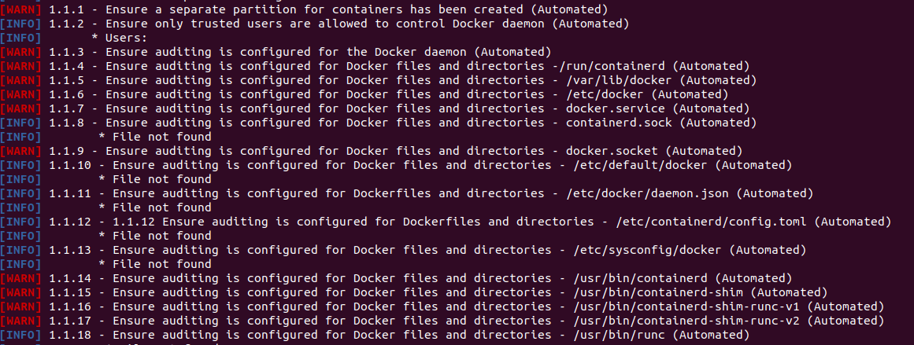

# UT3.PC01 Seguridad y desplegado de aplicaciones con Docker

## Docker-Bench

Lo primero que haremos será ejecutar docker-bench para ver en que estado se encuentra nuestra instalación de Docker.



Como vemos en la imagen superior tenemos muchos warn e info provocados por no auditar los ficheros y directorios que docker recomienda controlar. Es por ello que vamos a instalar una herramienta llamada audit la cual nos permite generar reglas las cuales nos ayuden tener un registro de esto.

### Auditd

Para instalar auditd simplemente tenemos que ejecutar el siguiente comando:

```bash
sudo apt-get install auditd
```

una vez dentro de este fichero tendremos que generar una regla por cada archivo que docker nos muestra.


> Como podemos ver en la imagen de la izquierda generando las siguientes reglas podemos controlar los ficheros que anteriormente nos aparecian como warnings gracias a esto si volvemos a realizar el benchmark veremos los siguientes resultados:
> 


### Warnings, Warnings y mas Warnings

Como podemos ver aunque ahora estemos auditando nuestro sistema tenemos mas Warns que se generan por una mala configuración o falta de esta como podemos ver a continuación.


Es por eso que para corregir este tipo de Warns deberemos de crear un fichero llamado daemon.json el cual nos permitira configurar y activar las diferentes funciones que docker-bench nos recomienda activar para mejorar la seguridad de nuestra instalación.


> Para realizar esto crearemos el fichero /etc/docker/daemon.json el cual ya tenemos auditado con la utilidad que vimos anterioremente.
> 

Como vemos en la siguiente imagen este archivo de configuración en formato .json nos permite eliminar mucho de los warning que teniamos pero entremos en profundidad en alguno de los “fallos” que hemos solucionado.


En especial vamos a centrarnos en 2 warning que hemos solucionado el 2.14 y 2.15

El primero de estos hace referencia a la posibilidad de realizar una escalada de privilegios con algunos comandos en nuestros dockers, por norma general estos son utilizados por *“non-root users”* por lo que evitar este tipo de acciones es muy importante a la hora de dar seguridad a nuestro entorno. Esto es solucionado con la siguiente linea de codigo introducida en nuestro .json.

```bash
"no-new-privileges": true
```

El siguiente hace referencia a la posibilidad de mantener nuestros dockers levantados incluso cuando estamos reiniciando el servicio de docker, ya sea por una modificación en nuestros ficheros de configuración u otras razones. Para evitar que las maquinas se tumben cuando reiniciamos el docker podemos introducir la siguiente linea de codigo en nuestro fichero .json.

```bash
"live-restore": true
```

## ***Análisis de archivos dockerfile***

Realizando un analisis de un fichero dockerfile el cual generamos anteriormente podemos ver las vulnerabilidades que se encuentran en nuestro docker.


La solucion de estos problemas pasa por actualizar los servicios que tenemos corriendo en nuestra maquina a versiones mas modernas.

Encontramos problemas de seguridad en librerias que se instalan con la base que utilizan ya que esta es oracle 8.7 en concreto encontramos las mayores vulnerabilidades en la libreria de criptografia y en un binario de gosu el cual es descargado desde github.

## Comparando wordpress

Empezaremos descargando ambas imagenes a nuestro equipo para ver de forma local las vulnerabilidades que tienen cada una. Una vez las tenemos a traves de un docker pull hacemos los analisis para ver los siguientes resultados:


Lo primero que podemos ver es que actualmente wordpress 4.6 tiene un 500.1% mas vulnerabiliades que las ultimas versiones.

Podemos comparar de forma sencilla las vulnerabilidades encontradas en la ultima versión las cuales tienen un severidad critica. 


Como vemos las vulnerabilidades que afectan a esta versión en concreta aun no tienen fix ya que son recientes y se basan en las librerias curl, libaom0, libcurl14, libdb5.3 y libde265-0.

si por otro lado miramos algunas de las que nos podemos encontrar en wordpress 4.6 podemos comparar con las que tiene la ultima versión por ejemplo en la libreria curl.


Como vemos tiene una versión mucho mas antigua la cual trae una gran cantidad de vulnerabilidades las cuales se pueden solucionar actualizando esta libreria. Esta es solo una de las muchas que contiene ya que cuenta como vimos anteriormente con 264 vulnerabilidades consideradas Criticas.